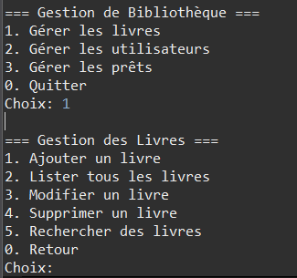

# LibroConsole

Une application console Java permettant de gérer une bibliothèque avec les fonctionnalités de gestion des livres, des utilisateurs, et du prêt de livres.




##  Objectifs

Ce projet vise à appliquer les concepts de :
- Généricité en Java
- Accès aux bases de données relationnelles via JDBC
- Manipulation de collections d’objets avec des classes génériques
- Programmation orientée objet (POO)

---

##  Technologies utilisées

| Outil/Technologie     | Détail                         |
|------------------------|--------------------------------|
|  IDE                | Eclipse                        |
|  SDK Java           | JRE 24                         |
|  Base de données   | MySQL via XAMPP (Apache+SQL)   |
|  Connexion BDD     | JDBC avec driver SQL placé dans `/lib` |
|  Interface          | Console (pas d’interface graphique) |

---

##  Fonctionnalités

### Gestion des livres
- Ajouter, modifier, supprimer un livre
- Attributs : `titre`, `auteur`, `année de publication`, `genre`, etc.

### Gestion des utilisateurs
- Ajouter, modifier, supprimer un utilisateur
- Informations : `nom`, `email`, `téléphone`, etc.

### Système de prêt de livres
- Emprunter et rendre un livre
- Gestion des dates d’emprunt et de retour
- Système de pénalité en cas de retard

### Recherche avancée
- Recherche de livres par auteur, genre, etc.

---

##  Concepts techniques

### Généricité
- `Repository<T>` : une classe générique pour les opérations CRUD sur tous types d’objets (`Livre`, `Utilisateur`, etc.)
- Listes génériques pour une gestion flexible des collections

###  Base de données

#### Tables :
- **Livres** : `id`, `titre`, `auteur`, `annee`, `genre`
- **Utilisateurs** : `id`, `nom`, `email`, `telephone`
- **Prets** : `id`, `utilisateur_id`, `livre_id`, `date_emprunt`, `date_retour`

---

##  Lancer le projet

1. Ouvrir le projet dans Eclipse (ou n'importe quel éditeur qui supporte Java)
2. Démarrer XAMPP (Apache + MySQL)
3. Creer une base de donnée "bibliothèque" et lance ça :
 <pre> ```sql CREATE TABLE Livres ( id INT PRIMARY KEY AUTO_INCREMENT, titre VARCHAR(100), auteur VARCHAR(100), annee INT, genre VARCHAR(50) ); CREATE TABLE Utilisateurs ( id INT PRIMARY KEY AUTO_INCREMENT, nom VARCHAR(100), email VARCHAR(100), telephone VARCHAR(20) ); CREATE TABLE Prets ( id INT PRIMARY KEY AUTO_INCREMENT, utilisateur_id INT, livre_id INT, date_emprunt DATE, date_retour DATE, FOREIGN KEY (utilisateur_id) REFERENCES Utilisateurs(id), FOREIGN KEY (livre_id) REFERENCES Livres(id) ); ``` </pre>

4. Vérifier que le driver JDBC est bien dans le dossier `/lib`
5. Lier le fichier .jar au projet : Clic droit sur le projet > Build Path > Configure Build Path > Libraries > Add JARs...
6. Exécuter le fichier `GestionBibliotheque.java`

---

##  Auteur

Lovasoa David
Étudiant en L3 Informatique (GE-IT) 
Email : lovasoarm@gmail.com

---

##  Remarque

- Ce projet est entièrement en **console** (pas d’interface Swing ou JavaFX).
